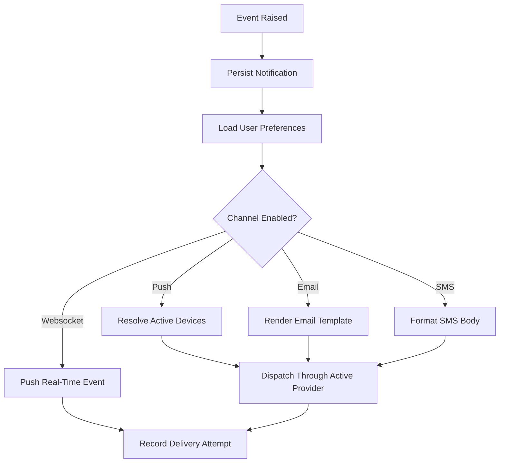

# Activity Diagrams

```mermaid
flowchart TD
  A[Event Raised] --> B[Persist Notification]
  B --> C[Load User Preferences]
  C --> D{Channel Enabled?}
  D -->|Websocket| E[Push Real-Time Event]
  D -->|Push| F[Resolve Active Devices]
  D -->|Email| G[Render Email Template]
  D -->|SMS| H[Format SMS Body]
  F --> I[Dispatch Through Active Provider]
  G --> I
  H --> I
  E --> J[Record Delivery Attempt]
  I --> J
```
