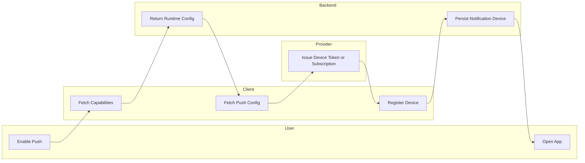

# Swimlane Diagrams

```mermaid
flowchart LR
  subgraph User
    U1[Enable Push]
    U2[Open App]
  end
  subgraph Client
    C1[Fetch Capabilities]
    C2[Fetch Push Config]
    C3[Register Device]
  end
  subgraph Backend
    B1[Return Runtime Config]
    B2[Persist Notification Device]
  end
  subgraph Provider
    P1[Issue Device Token or Subscription]
  end

  U1 --> C1 --> B1 --> C2 --> P1 --> C3 --> B2 --> U2
```
