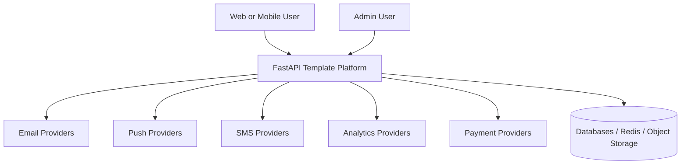

# System Context Diagram

```mermaid
flowchart TB
  User[Web or Mobile User]
  Admin[Admin User]
  Template[FastAPI Template Platform]
  Email[Email Providers]
  Push[Push Providers]
  SMS[SMS Providers]
  Analytics[Analytics Providers]
  Payments[Payment Providers]
  Infra[(Databases / Redis / Object Storage)]

  User --> Template
  Admin --> Template
  Template --> Email
  Template --> Push
  Template --> SMS
  Template --> Analytics
  Template --> Payments
  Template --> Infra
```
