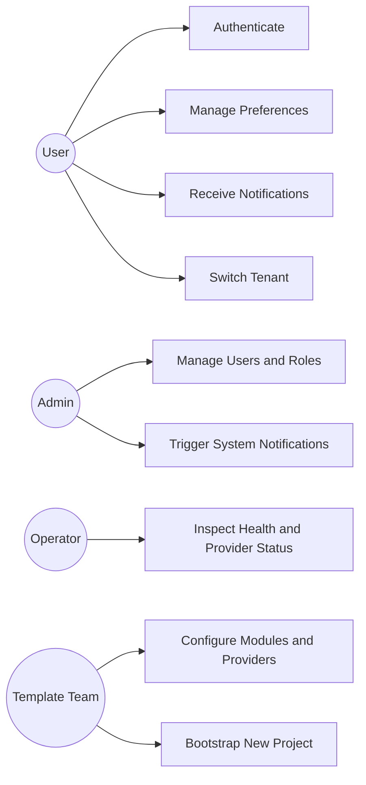

# Use Case Diagram

```mermaid
flowchart LR
  User((User))
  Admin((Admin))
  Operator((Operator))
  TemplateTeam((Template Team))

  User --> UC1[Authenticate]
  User --> UC2[Manage Preferences]
  User --> UC3[Receive Notifications]
  User --> UC4[Switch Tenant]
  Admin --> UC5[Manage Users and Roles]
  Admin --> UC6[Trigger System Notifications]
  Operator --> UC7[Inspect Health and Provider Status]
  TemplateTeam --> UC8[Configure Modules and Providers]
  TemplateTeam --> UC9[Bootstrap New Project]
```
