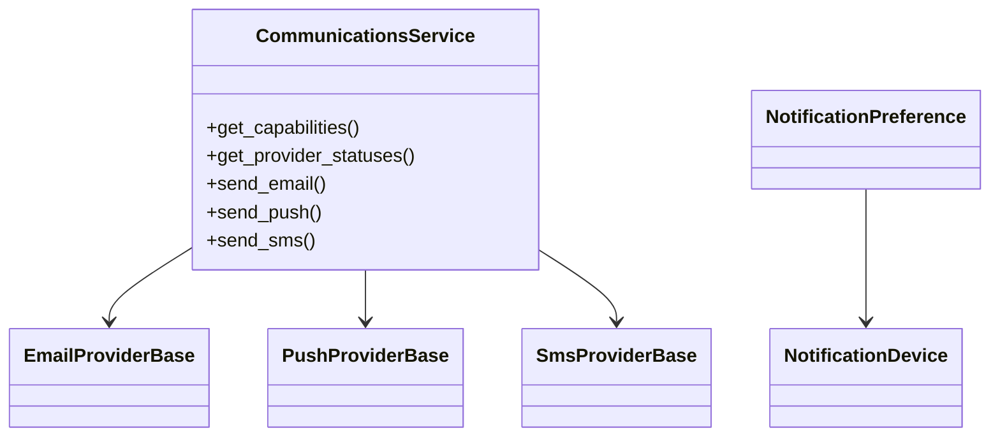

# Class Diagrams

```mermaid
classDiagram
  class CommunicationsService {
    +get_capabilities()
    +get_provider_statuses()
    +send_email()
    +send_push()
    +send_sms()
  }
  class EmailProviderBase
  class PushProviderBase
  class SmsProviderBase
  class NotificationDevice
  class NotificationPreference

  CommunicationsService --> EmailProviderBase
  CommunicationsService --> PushProviderBase
  CommunicationsService --> SmsProviderBase
  NotificationPreference --> NotificationDevice
```
