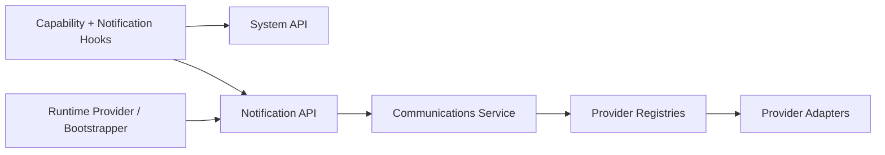

# Component Diagrams

```mermaid
flowchart LR
  ClientHooks[Capability + Notification Hooks]
  UIRuntime[Runtime Provider / Bootstrapper]
  SystemAPI[System API]
  NotificationAPI[Notification API]
  Comms[Communications Service]
  Registries[Provider Registries]
  Adapters[Provider Adapters]

  ClientHooks --> SystemAPI
  ClientHooks --> NotificationAPI
  UIRuntime --> NotificationAPI
  NotificationAPI --> Comms
  Comms --> Registries
  Registries --> Adapters
```
