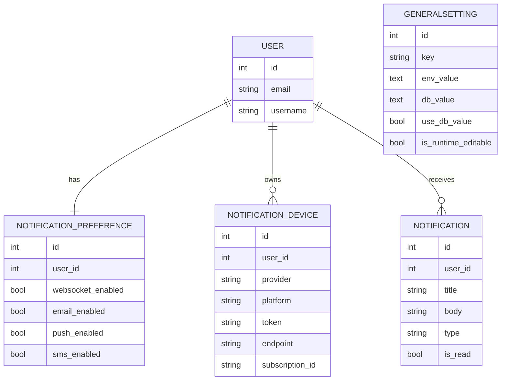

# ERD Database Schema

## Notes

- `GENERALSETTING` is a standalone runtime-configuration table rather than a tenant-owned business entity.
- It is seeded during migration and refreshed on startup so operators can compare environment and database values safely.
