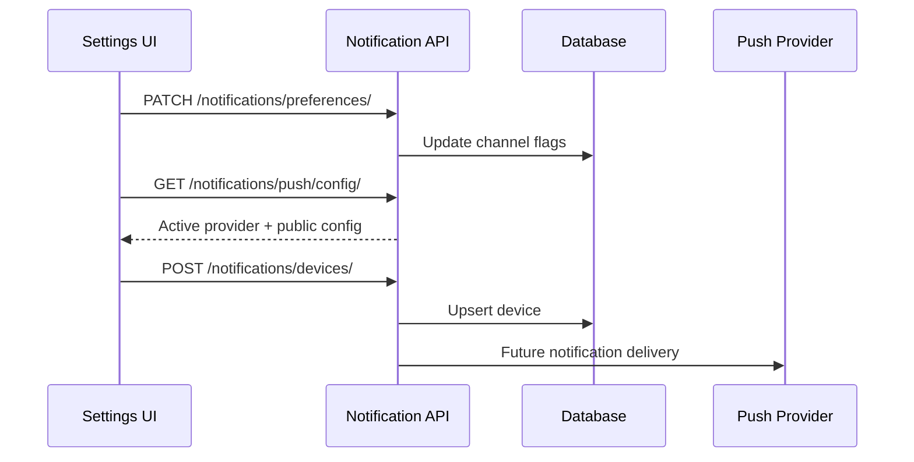

# Sequence Diagrams

```mermaid
sequenceDiagram
  participant Settings as Settings UI
  participant API as Notification API
  participant DB as Database
  participant Push as Push Provider

  Settings->>API: PATCH /notifications/preferences/
  API->>DB: Update channel flags
  Settings->>API: GET /notifications/push/config/
  API-->>Settings: Active provider + public config
  Settings->>API: POST /notifications/devices/
  API->>DB: Upsert device
  API->>Push: Future notification delivery
```
