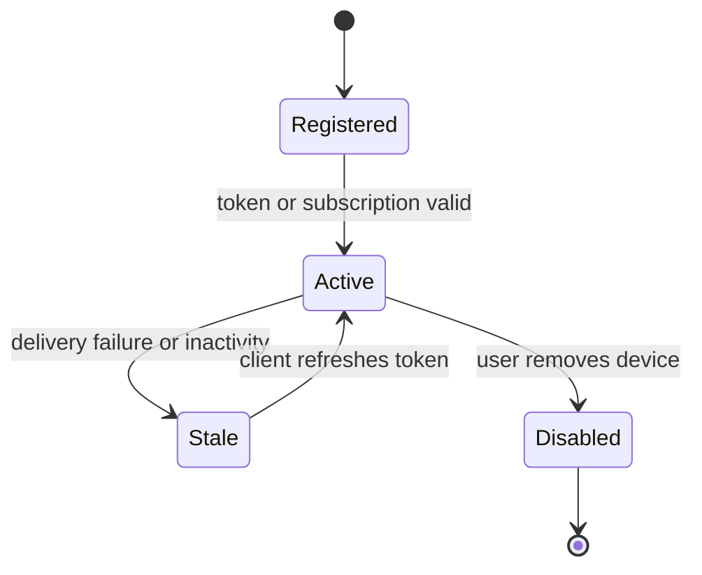

# State Machine Diagrams

```mermaid
stateDiagram-v2
  [*] --> Registered
  Registered --> Active: token or subscription valid
  Active --> Stale: delivery failure or inactivity
  Stale --> Active: client refreshes token
  Active --> Disabled: user removes device
  Disabled --> [*]
```
