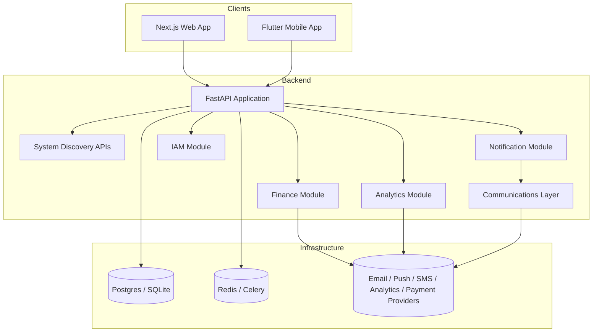

# Architecture Diagram

```mermaid
flowchart TB
  subgraph Clients
    Web[Next.js Web App]
    Mobile[Flutter Mobile App]
  end

  subgraph Backend
    API[FastAPI Application]
    System[System Discovery APIs]
    Notify[Notification Module]
    Finance[Finance Module]
    IAM[IAM Module]
    Analytics[Analytics Module]
    Comms[Communications Layer]
  end

  subgraph Infrastructure
    DB[(Postgres / SQLite)]
    Redis[(Redis / Celery)]
    Providers[(Email / Push / SMS / Analytics / Payment Providers)]
  end

  Web --> API
  Mobile --> API
  API --> System
  API --> Notify
  API --> Finance
  API --> IAM
  API --> Analytics
  Notify --> Comms
  Finance --> Providers
  Analytics --> Providers
  Comms --> Providers
  API --> DB
  API --> Redis
```
