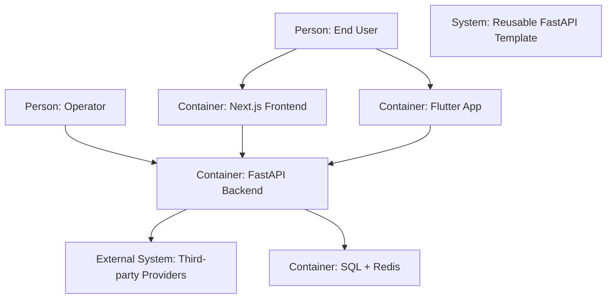

# C4 Diagrams

```mermaid
flowchart TB
  Person1[Person: End User]
  Person2[Person: Operator]
  System[System: Reusable FastAPI Template]
  Web[Container: Next.js Frontend]
  Mobile[Container: Flutter App]
  API[Container: FastAPI Backend]
  Providers[External System: Third-party Providers]
  Data[Container: SQL + Redis]

  Person1 --> Web
  Person1 --> Mobile
  Person2 --> API
  Web --> API
  Mobile --> API
  API --> Providers
  API --> Data
```
