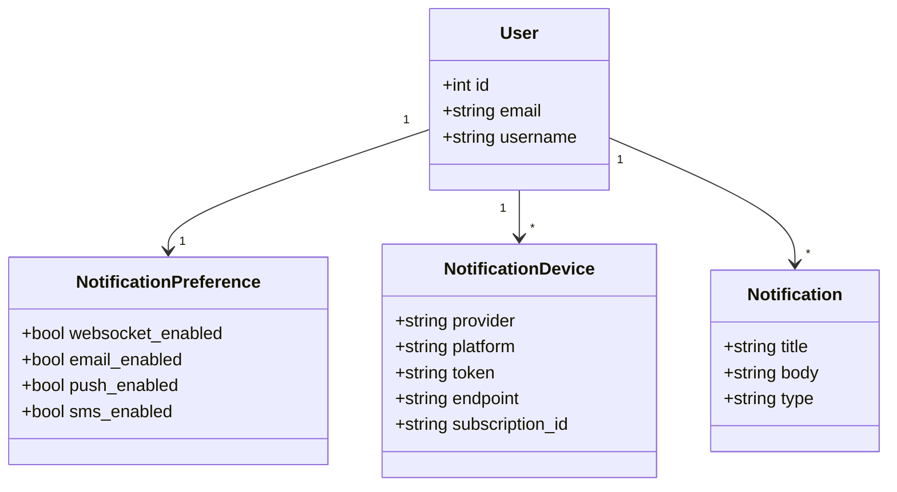

# Domain Model

```mermaid
classDiagram
  class User {
    +int id
    +string email
    +string username
  }
  class NotificationPreference {
    +bool websocket_enabled
    +bool email_enabled
    +bool push_enabled
    +bool sms_enabled
  }
  class NotificationDevice {
    +string provider
    +string platform
    +string token
    +string endpoint
    +string subscription_id
  }
  class Notification {
    +string title
    +string body
    +string type
  }

  User "1" --> "1" NotificationPreference
  User "1" --> "*" NotificationDevice
  User "1" --> "*" Notification
```
