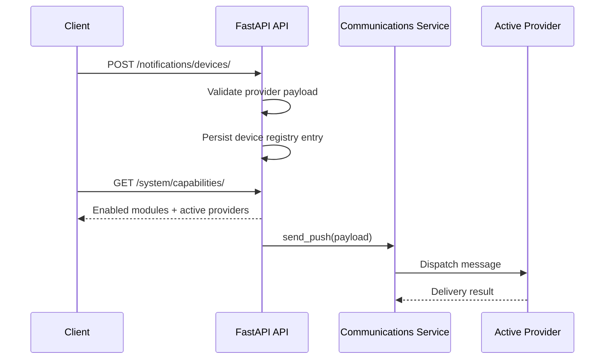

# System Sequence Diagrams

```mermaid
sequenceDiagram
  participant Client
  participant API as FastAPI API
  participant Comms as Communications Service
  participant Provider as Active Provider

  Client->>API: POST /notifications/devices/
  API->>API: Validate provider payload
  API->>API: Persist device registry entry
  Client->>API: GET /system/capabilities/
  API-->>Client: Enabled modules + active providers
  API->>Comms: send_push(payload)
  Comms->>Provider: Dispatch message
  Provider-->>Comms: Delivery result
```
