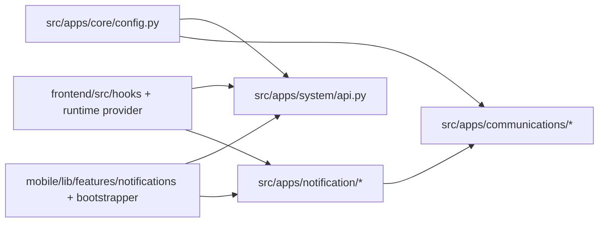

# C4 Code Diagram

```mermaid
flowchart LR
  Config[src/apps/core/config.py]
  System[src/apps/system/api.py]
  Comms[src/apps/communications/*]
  Notify[src/apps/notification/*]
  Frontend[frontend/src/hooks + runtime provider]
  Mobile[mobile/lib/features/notifications + bootstrapper]

  Config --> System
  Config --> Comms
  Notify --> Comms
  Frontend --> System
  Frontend --> Notify
  Mobile --> System
  Mobile --> Notify
```
