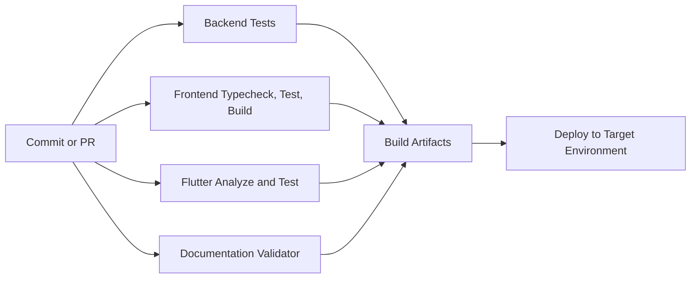

# CI/CD

```mermaid
flowchart LR
  Commit[Commit or PR] --> Backend[Backend Tests]
  Commit --> Frontend[Frontend Typecheck, Test, Build]
  Commit --> Mobile[Flutter Analyze and Test]
  Commit --> Docs[Documentation Validator]
  Backend --> Package[Build Artifacts]
  Frontend --> Package
  Mobile --> Package
  Docs --> Package
  Package --> Deploy[Deploy to Target Environment]
```
