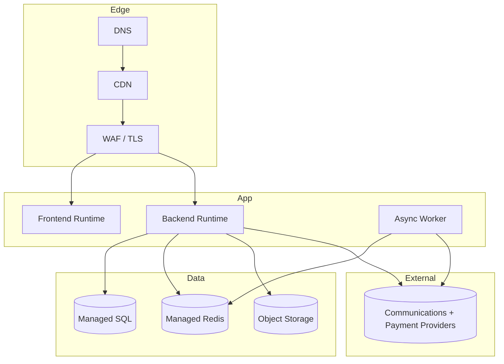

# Cloud Architecture

```mermaid
flowchart TB
  subgraph Edge
    DNS[DNS]
    CDN[CDN]
    WAF[WAF / TLS]
  end
  subgraph App
    Web[Frontend Runtime]
    API[Backend Runtime]
    Worker[Async Worker]
  end
  subgraph Data
    SQL[(Managed SQL)]
    Cache[(Managed Redis)]
    Storage[(Object Storage)]
  end
  subgraph External
    Providers[(Communications + Payment Providers)]
  end

  DNS --> CDN --> WAF --> Web
  WAF --> API
  API --> SQL
  API --> Cache
  API --> Storage
  Worker --> Cache
  API --> Providers
  Worker --> Providers
```
