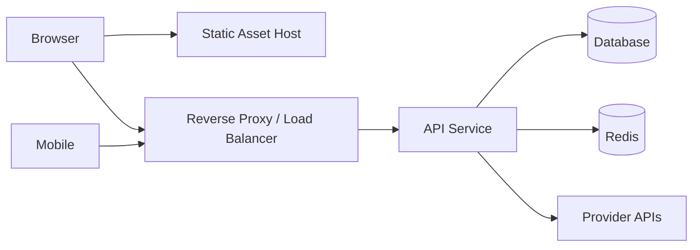

# Network Infrastructure

```mermaid
flowchart LR
  Browser --> CDN[Static Asset Host]
  Browser --> LB[Reverse Proxy / Load Balancer]
  Mobile --> LB
  LB --> API[API Service]
  API --> DB[(Database)]
  API --> Redis[(Redis)]
  API --> Internet[Provider APIs]
```
